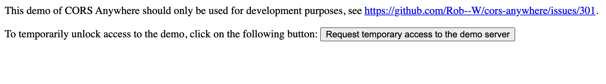

# LYRICBOO

https://cgtodd85.github.io/lyric-search/

## screenshots

# ALERT

In order to use app there is cors-anywhere workaround. Simply input your first search lyric, click search. You will see no results. Right click anywhere and choose inspect, go to the console log, click the link provided with the 403 error shown below. Then on the page that appears click the button that says 'request temporary access to server'. Return to Lyricboo, refresh the page, and search away!

### Usage

Lyricboo is designed to find the song that's stuck in your head! Users can type in the lyrics to the song that they're looking for in the searchbar. Lyricboo then works her magic and will display the top 5 most relevant results!

Clicking the show lyrics button will generate the song lyrics on the right side of the screen, and clicking the Music Video button will open the official music video on YouTube in a new window.

Lyricboo also highlights the lyrics that the user searched for in a yellow highlight.

### APIs

This site is using the Musixmatch API as well as the YouTube Data v3 API.

### Contributors

Joe Wood, Connor Todd, Gulshat Tokhtarova (Group 6)

### :ticket: License

[MIT](https://choosealicense.com/licenses/mit/)
